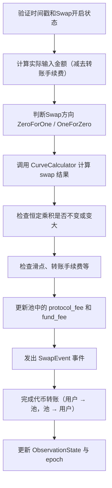

# 🧠 Solana Anchor Swap 函数（二）解析与总结

## 📘 函数：`swap_base_input`

该函数实现了一个基于输入金额（Base Input）的 AMM Swap 操作。用户指定输入代币数量，程序根据当前池状态计算输出代币数量，完成 Token 的互换。

---

## 🔄 函数流程概述



---

## 🔍 核心要点解析

### 1. 🕒 校验时间与状态

```rust
if !pool_state.get_status_by_bit(PoolStatusBitIndex::Swap)
    || block_timestamp < pool_state.open_time
```

确保当前时间超过池的开启时间，且池状态支持 Swap。

---

### 2. 💸 实际输入金额计算

```rust
let transfer_fee = get_transfer_fee(&ctx.accounts.input_token_mint.to_account_info(), amount_in)?;
let actual_amount_in = amount_in.saturating_sub(transfer_fee);
```

如果 Token 开启了 Transfer Fee（如 SPL Token 2022），此处扣除，确保 swap 逻辑基于实际到账金额。

---

### 3. 🔄 识别交易方向 & 价格计算

```rust
if input_vault == token_0_vault && output_vault == token_1_vault {
    TradeDirection::ZeroForOne
} else if ...
```

- 使用池中 Vault 对应关系判断是 `ZeroForOne` 还是 `OneForZero`  
- 读取当前价格并计算 token 价格

---

### 4. 📈 Swap 核心计算

```rust
let result = CurveCalculator::swap_base_input(...)?;
```

通过 AMM 曲线计算：

- 实际 Swap 的 `source_amount_swapped` 和 `destination_amount_swapped`
- Swap 后新 vault 余额（不含手续费）
- 产生的各种手续费

---

### 5. ⚖️ 恒定乘积校验

```rust
require_gte!(constant_after, constant_before);
```

恒定乘积校验用于检测流动性变化是否符合 AMM 曲线设定，保障价格变化合理。

---

### 6. 💰 手续费处理

```rust
match trade_direction {
    TradeDirection::ZeroForOne => {
        pool_state.protocol_fees_token_0 += protocol_fee;
        pool_state.fund_fees_token_0 += fund_fee;
    }
    ...
}
```

- 协议费用 (`protocol_fee`) 及基金费用 (`fund_fee`) 按 Swap 方向计入不同代币

---

### 7. 🔁 Token 转账

```rust
transfer_from_user_to_pool_vault(...)
transfer_from_pool_vault_to_user(...)
```

- 从用户 → 池子（input）  
- 从池子 → 用户（output）  
- 使用不同的 SPL Interface 进行 token 转账，并考虑 decimals 精度

---

### 8. 🔮 更新预言机观测状态

```rust
ctx.accounts.observation_state.load_mut()?.update(...)
```

用于后续价格追踪或 TWAP 使用，记录本次交易后的 token 价格。

---

## 📑 SwapEvent 日志结构

```rust
emit!(SwapEvent {
    pool_id,
    input_vault_before,
    output_vault_before,
    input_amount,
    output_amount,
    input_transfer_fee,
    output_transfer_fee,
    base_input: true
});
```

便于链上分析工具追踪 swap 数据。

---

## ✅ 总结重点

| 模块             | 功能说明                                     |
|------------------|----------------------------------------------|
| 权限与状态检查   | 校验交易是否允许执行（如时间与状态）         |
| Fee 扣除         | 对输入输出 Token 的 Transfer Fee 进行处理     |
| Curve 计算       | 使用 CurveCalculator 获取 swap 结果及手续费   |
| 恒定乘积校验     | 确保曲线不被破坏                             |
| Token 交换       | 实际代币转账                                 |
| 预言机更新       | 记录 token 的价格信息                         |

---

